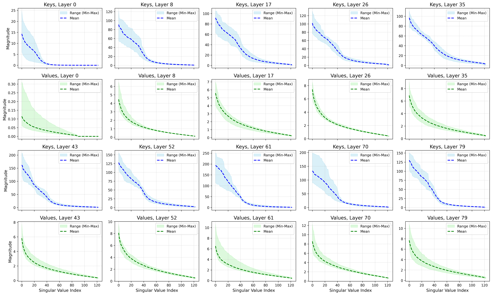

# KV Cache Quantization


- [Quantize What Counts: Bit Allocation Insights Informed by Spectral Gaps in Keys and Values](https://arxiv.org/abs/2502.15075v2)  
  - **TL;DR:** Keys carry more information than values → allocate more bits to keys than values in KV cache quantization.

- **Norm-Aware KVQuant: Precision Where It Counts**  
  - **TL;DR:** Performs layer-wise bit allocation for KV cache quantization, guided by the norm and spectral gap between keys and values.


## Quantize What Counts

**Key-Value Norm Disparity** 

The expected Frobenius norm of key projections is consistently greater than that of value projections.


<p align="center">
  <strong>$\mathbb{E}[\|W_K\|_F] \;>\; \mathbb{E}[\|W_V\|_F]$</strong>
</p>

This indicates that key matrices carry richer and more substantial information compared to value matrices.

**Corollary**
<p align="center"> <strong>$\mathbb{E}[\|K\|_F] \;>\; \mathbb{E}[\|V\|_F]$</strong> </p>


**Key-Driven Quantization**

Allocating higher bit precision to keys rather than values significantly improves quantization efficiency. Formally, for bit allocations $(b_K, b_V)$:

If $b_K > b_V$, then the expected inference accuracy under allocation $(b_K, b_V)$ is strictly higher than that under the reversed allocation $(b_V, b_K)$.

<figure>
  
  <figcaption>
    <strong>Singular value distribution of key and value activations for Llama 3.3-70B on C4.</strong>  
    The x-axis represents the singular value indices, ordered from the 5th largest to the smallest, while the y-axis denotes the magnitude of the singular values. The shaded region indicates the minimum-to-maximum range across attention heads within each layer, and the solid lines represent the mean singular value magnitude at each index. Key matrices exhibit consistently higher singular values even in the lower ranges, underscoring their greater representational significance compared to value matrices.
  </figcaption>
</figure>

## Norm-Aware KVQuant


### Supported backends

- [x] [Quanto](https://github.com/huggingface/optimum-quanto)
- [x] [HQQ](https://mobiusml.github.io/hqq_blog/)

`kvq` supports the following models:


- Qwen 3.0
  - Qwen/Qwen3-0.6B
  - Qwen/Qwen3-4B
  - Qwen/Qwen3-8B
  - Qwen/Qwen3-14B
  - Qwen/Qwen3-32B

- Llama 3.0
  - meta-llama/Meta-Llama-3-8B
  - meta-llama/Meta-Llama-3-8B-Instruct
- Llama 3.2
  - meta-llama/Llama-3.2-1B
  - meta-llama/Llama-3.2-1B-Instruct
  - meta-llama/Llama-3.2-3B
  - meta-llama/Llama-3.2-3B-Instruct
- Llama 3.3
  - meta-llama/Llama-3.3-70B-Instruct


`KVQ` can be installed via pip:

```bash
pip install kvq
```

### Usage


Work in progress. The code will be released soon.


## Citation

If you find our method useful, please kindly cite our paper.

```bibtex
@article{hariri2025quantize,
  title={Quantize What Counts: Bit Allocation Insights Informed by Spectral Gaps in Keys and Values},
  author={Hariri, Mohsen and Luo, Alan and Nemati, Mohammadreza and Nguyen, Lam and Zhong, Shaochen and Wang, Qifan and Hu, Xia and Han, Xiaotian and Chaudhary, Vipin},
  journal={arXiv preprint arXiv:2502.15075},
  year={2025}
}

```

## License
The code is released under the MIT License.


